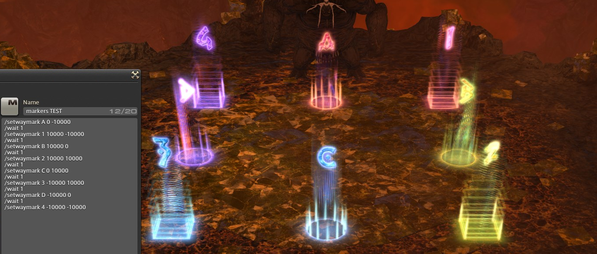
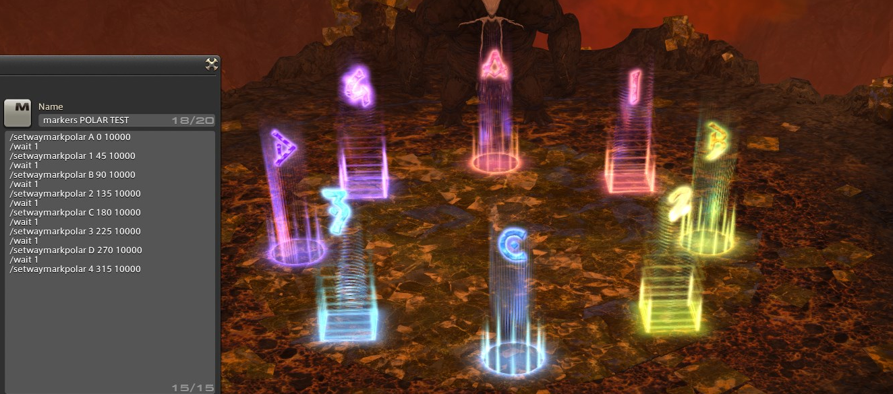

# WaymarkOCD

WaymarkOCD is a plugin that allows you to place waymarks using macros. This allows you to keep your markers in pixel-perfect alignment. 

A big thanks to [WaymarkPresetPlugin](https://github.com/PunishedPineapple/WaymarkPresetPlugin) for pioneering the manipulation of waymarks programmatically. 

## /setwaymark
Using the `/setwaymark` command, you can place waymarks in specific X/Y positions:
```
/setwaymark A 0 -10000
/wait 1
/setwaymark 1 10000 -10000
/wait 1
/setwaymark B 10000 0
/wait 1
/setwaymark 2 10000 10000
/wait 1
/setwaymark C 0 10000
/wait 1
/setwaymark 3 -10000 10000
/wait 1
/setwaymark D -10000 0
/wait 1
/setwaymark 4 -10000 -10000
```

This will yield perfectly aligned markers in a square formation:



## /setwaymarkpolar
Using the `/setwaymarkpolar` command, you can place waymarks circularly:
```
/setwaymarkpolar A 0 10000
/wait 1
/setwaymarkpolar 1 45 10000
/wait 1
/setwaymarkpolar B 90 10000
/wait 1
/setwaymarkpolar 2 135 10000
/wait 1
/setwaymarkpolar C 180 10000
/wait 1
/setwaymarkpolar 3 225 10000
/wait 1
/setwaymarkpolar D 270 10000
/wait 1
/setwaymarkpolar 4 315 10000
```

This will yield perfectly circular markers, distanced 10,000 units from the center of the arena:



WARNING: `/setwaymarkpolar` assumes that 0,0 is the center of the arena. This is true for every instance I tested, but I did not test every single instance. 
